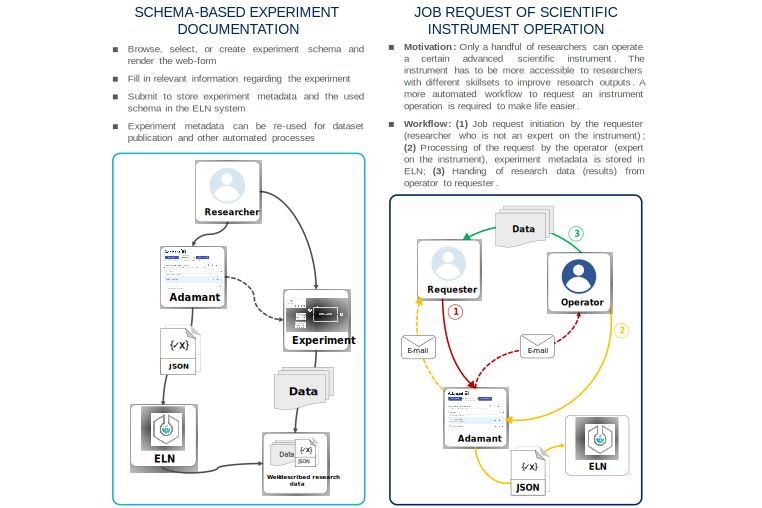

# 

Adamant is a JSON schema-based metadata creation tool presented in a user-friendly interface. Adamant aims to ease the integration of various research data management (RDM) workflows into the everyday research routine of especially small independent laboratories, which hopefully leads to the generation of research data that adhere to the FAIR (findable, accessible, interoperable, reusable) principles.
As of now, Adamant supports the following features:

- Rendering of interactive web-form based on a valid JSON schema
- User-friendly editing process of the rendered web-form and the corresponding schema
- Creating a valid JSON schema and web-form from scratch
- Live validation for various field types
- Quick re-use of existing schemas from a list
- Downloadable JSON schema and its form data
- API-based integration as various form submission functionalities

A live demo of Adamant (client only) is available at: https://plasma-mds.github.io/adamant/.

Accompanying article can be found at: https://f1000research.com/articles/11-475/v2, which includes the technical description of the tool and its main use cases.

[](https://github.com/csihda/adamant/blob/main/LICENSE)

# Changelog

## [1.3.0] June 30, 2025
### Added (only available when deployed with a backend)
- Start dialog for selecting different use cases (see general conf `src/general-conf.json` to enable this)
- Browse-and-edit functionality for eLabFTW experiments created with Adamant
- Faux-login using a user-generated eLabFTW API token
### Changed
- Backend `api.py` to support [eLabFTW v5.2.0](https://www.deltablot.com/posts/release-50200/#api-improvements)
- Location of toast messages is now on the bottom right
- Render schema workflow: removed the compile step and added "edit mode"
### Removed
- HTML/description list representation of the form in the experiment body

# Main use cases
# 

# Supported JSON schema keywords
Currently, Adamant supports the rendering and editing of JSON schemas with a specification version draft 4 and 7. The following table lists all the implemented JSON schema keywords in the current version of Adamant. Note that the `id` keyword only works with the JSON schema specification version draft 4, whereas `$id` is used for the newer specification drafts. Lastly, the `contentEncoding` keyword is intended to be used with the specification version draft 7 or newer.

| Field Type | Implemented Keywords | Note |
|-----------|----------------------|----|
|String|`title`, `id`, `$id`, `description`, `type`, `enum`, `contentEncoding`, `default`, `minLength`, `maxLength`|`contentEncoding` can only receive a string value of `"base64"`|
|Number| `title`, `id`, `$id`, `description`, `type`, `enum`, `default`, `minimum`, `maximum` | |
|Integer| `title`, `id`, `$id`, `description`, `type`, `enum`, `default`, `minimum`, `maximum` | |
|Boolean| `title`, `id`, `$id`, `description`, `type`, `default` | |
|Array| `title` , `id`, `$id`, `description`, `type`, `default`, `items`, `minItems`, `maxItems`, `uniqueItems` | |
|Object| `title`, `id`, `$id`, `description`, `type`, `properties`, `required` | |

# Development

__Known dependencies__: Node.js v14.15.5 and Python 3.8. The rests are handled by `package.json` and `backend/requirements.txt`.

Setting up Adamant on a local machine for development:
- `$ git clone https://github.com/csihda/adamant.git`—clone the repository
- `$ cd adamant`—go to adamant project directory
- `adamant$ npm install`—install the dependencies for the client-side
- `adamant$ cd backend`—go to backend directory
- `adamant/backend$ python -m venv venv`—create a python virtual environment
- Windows: `adamant/backend$ ./venv/Scripts/activate`—activate the virtual environment
- Linux: `adamant/backend$ source venv/bin/activate`—activate the virtual environment
- `adamant/backend$ pip install -r requirements.txt`—install the dependencies for the back-end
- `adamant/backend$ cd ..`—go back to adamant project directory
- `adamant$ yarn start-api`—start the back-end
- `adamant$ yarn start`—on a new terminal, in the adamant project directory, start the front-end

By default, Adamant is accessible at `http://localhost:3000`.


# Deployment
We recommend deploying Adamant with docker-compose, which can be done with ease:
- `$ git clone https://github.com/csihda/adamant.git`—clone the repository
- `$ cd adamant`—go to adamant project directory
- `adamant$ docker−compose build`—build the docker images for both back-end and front-end
- `adamant$ docker−compose up -d`—start both client and server containers, i.e., the whole system

By default, the deployed system can be accessed at `http://localhost:3000`.

# Citation

Please cite this paper if you use this code/tool in your publication. 
```
@article{ 10.12688/f1000research.110875.2,
author = {Chaerony Siffa, I and Schäfer, J and Becker, MM},
title = {Adamant: a JSON schema-based metadata editor for research data management workflows 
[version 2; peer review: 3 approved]},
journal = {F1000Research},
volume = {11},
year = {2022},
number = {475},
doi = {10.12688/f1000research.110875.2}
}
```

[](https://doi.org/10.12688/f1000research.110875.2)

# Grant information
The work was funded by the Federal Ministry of Education and Research (BMBF) under the grant mark 16QK03A. The responsibility for the content of this repository lies with the authors.

# To do's:
- [ ] Code refactoring
- [ ] Deprecate older specifications of JSON Schema (at least remove `draft-4`)
- [ ] Support newer specifications of JSON Schema (at least up to `2019-09`)
- [ ] ...